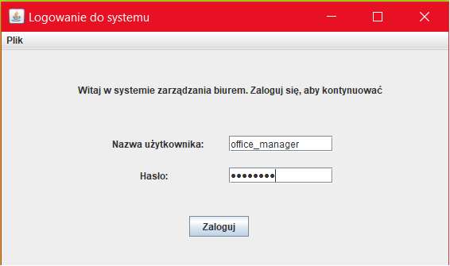
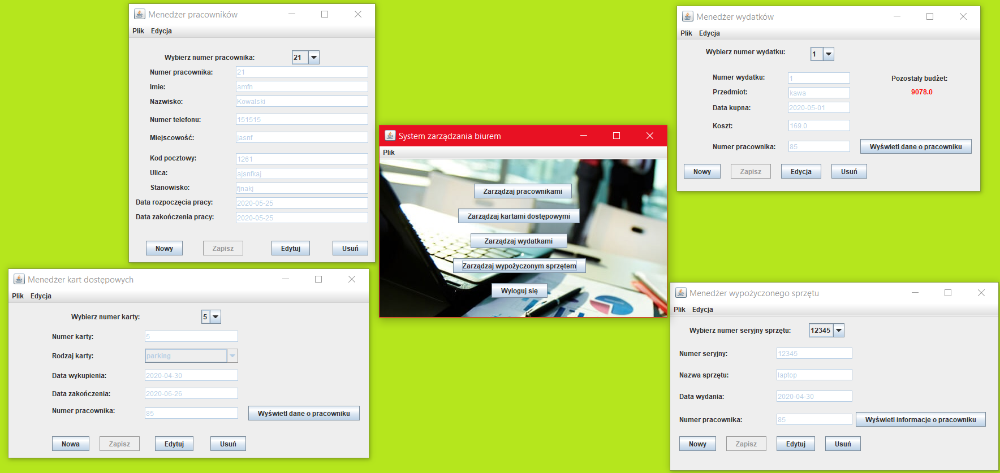

# OfficeManagementSystem
> An application that allows you to manage employee data

## Table of contents
* [General info](#general-info)
* [Screenshots](#screenshots)
* [Technologies](#technologies)
* [Features](#features)
* [Status](#status)
* [Contact](#contact)

## General info
The application has a login module and a choice of data management type. You can choose between employee management, access cards, rented equipment and budget. You can have several windows open at the same time, so switching between windows is easy. 
You can create new entries, edit and delete. The data is stored in a database and is accessed through secure procedures.

## Screenshots

  

  
 

## Technologies
* Java - version 11
* Java Swing
* SQL Server Database

## Features
List of features ready:
* Login module
* Management type selection
* Employee management
* Budget management
* Access card management
* Rental equipment management
* Adding, editing and deleting data

## Status
Project is: _finished_.

## Contact
Created by [Piotr Buczek](mailto:piotr.buczek37@gmail.com?subject=[GitHub]%20OfficeManagementSystem) - feel free to contact me!
